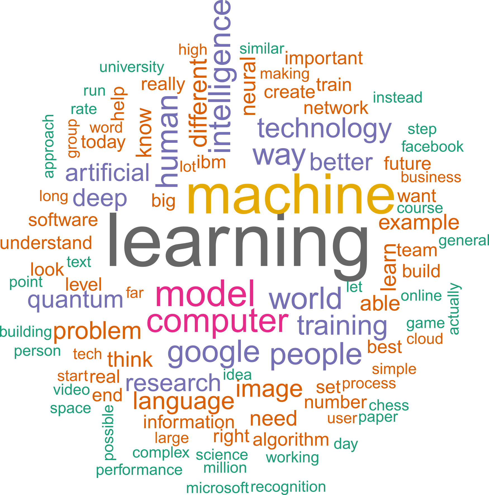
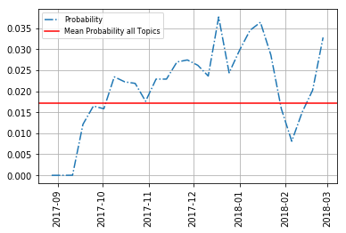

# Paragraph Vector Topic Model

This project provides users the ability to do topic modeling with [Paragraph Vector Topic Models](https://www.uni-marburg.de/fb02/makro/forschung/magkspapers/paper_2018/15-2018_lenz.pdf).


## Prerequisites

<ul>
<li> Gensim
</ul>


## Installation

Pull the repo from github.
```
git clone https://github.com/davidlenz/pvtm-core
cd pvtm-core
```


Install the required packages using pip. To install all packages required for topic generation and visualization use
```
pip install -r requirements.txt
```


If you don't want the visualizations (they need Inkscape, R and C++) use
```
pip install -r requirements_light.txt
```
instead. 


To verify correct setup, run the following:
```
python pvtm/pvtm.py -i data/sample_100.csv -o output
```
This will  run the algorithm using a small text sample. Larger samples are available in the data folder.

## Usage
```
pvtm.py [-h] -i INPUT [-o OUTPUT] [-l LANGUAGE] [-d2vp D2V_MODEL]
               [-gmmp GMM_MODEL] [-e EPOCHS] [-d DIMENSION] [-lt LEMMATHREADS]
               [-lbs LEMMABATCHSIZE] [-vmin VECTORIZERMIN]
               [-vmax VECTORIZERMAX] [-gv GMMVERBOSE] [-gi GMMNINITS]
               [-gr start end step] [-gcv GMMCVTYPES [GMMCVTYPES ...]]
               [-ntp NUMTOPICWORDS]

optional arguments:
  -h, --help            show this help message and exit
  -i INPUT, --input INPUT
                        path to the input data file
  -o OUTPUT, --output OUTPUT
                        Name of the folder where outputs are stored. Default =
                        './Output'
  -l LANGUAGE, --language LANGUAGE
                        Language used for lemmatization.
                        Default = 'en'
  -d2vp D2V_MODEL, --d2v_model D2V_MODEL
                        Provide a path to a folder where a Doc2Vec.model file
                        is stored. No new model will be trained but the pre-
                        trained model will be used instead.
  -gmmp GMM_MODEL, --gmm_model GMM_MODEL
                        Provide a path to a folder where a gmm.pkl file is
                        stored. No new model will be trained but the pre-
                        trained model will be used instead.
  -e EPOCHS, --epochs EPOCHS
                        Doc2Vec number epochs. Default = 10
  -d DIMENSION, --dimension DIMENSION
                        Doc2Vec embedding dimension. Default = 100
  -lt LEMMATHREADS, --lemmathreads LEMMATHREADS
                        Number of threads for the lemmatizer. Default = '-1'
  -lbs LEMMABATCHSIZE, --lemmabatchsize LEMMABATCHSIZE
                        Batch size for lemmatizer. Default = '300'
  -vmin VECTORIZERMIN, --vectorizermin VECTORIZERMIN
                        max number of documents in which a word has to appear
                        to be considered. Default = 2
  -vmax VECTORIZERMAX, --vectorizermax VECTORIZERMAX
                        max number of documents in which a word is allowed to
                        appear to be considered. Default = 0.95
  -gv GMMVERBOSE, --gmmverbose GMMVERBOSE
                        GMM verbosity during training. Default = 1
  -gi GMMNINITS, --gmmninits GMMNINITS
                        GMM number of initializations per component size.
                        Default = 2
  -gr start end step, --gmmrange start end step
                        specify a range
  -gcv GMMCVTYPES [GMMCVTYPES ...], --gmmcvtypes GMMCVTYPES [GMMCVTYPES ...]
                        GMM covariance matrix constraints. Takes values from
                        [spherical diag tied full]. Default =
                        ['spherical','diag','tied']
  -ntp NUMTOPICWORDS, --numtopicwords NUMTOPICWORDS
                        How many top words per topic to store. Default = 50

```


To display the options use
```
python pvtm/pvtm.py -help
```


## Visualizations
Once we have created an output folder with outputs from pvtm by running the above command, 
we can visualize the results using
```
python pvtm/pvtm_vis.py -path output
```


Note that the visualizations require an R installation which also needs to be in your system path.
=======
# Paragraph Vector Topic Model


This project providers users the ability to do topic modeling with [Paragraph Vector Topic Models](https://www.uni-marburg.de/fb02/makro/forschung/magkspapers/paper_2018/15-2018_lenz.pdf).





## Installation

Pull the repo from github.
```
git clone https://github.com/davidlenz/pvtm-core
cd pvtm-core
```


Install the required packages using pip
```
pip install -r requirements.txt
```


To verify correct setup, run the following:
```
python pvtm/pvtm.py -i data/sample_100.csv
```

## Usage

Run
```
python pvtm/pvtm.py -help
```
to see options.


## Visualizations
Once we have created an output folder with outputs from pvtm by running the above command, we can visualize the results using
```
python pvtm/pvtm_vis.py -path <path-to-folder>
```

Note that the visualizations require an R installation which also needs to be in your system path.

<br>


<br>
<br>
Note that the visualizations require Inkscape, R and a C++ compiler available through your systems path variable.

## Citation
tba
## Acknowledgements
tba

